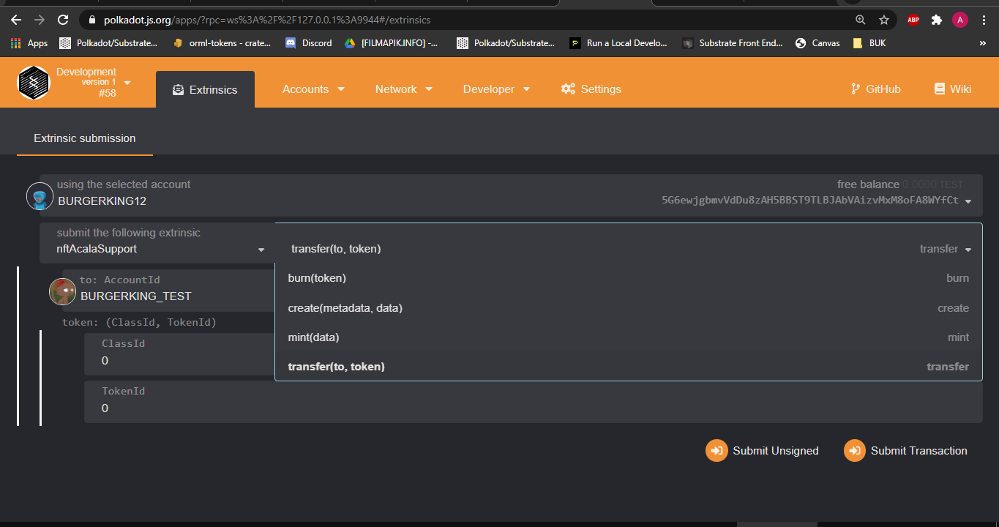

## Hackathon: Hello World! by Polkadot

# ACALA [ECOSYSTEM CHALLENGE] Enable NFT Support

### Prof.of UI | Transfer Token To | Burn | Mint | Create
- [x] 

    

### Plugins

| Plugin | Link |
| ------ | ------ |
| Subtrate | https://getsubstrate.io |
| Node Js | https://nodejs.org |
| Yarn | https://yarnpkg.com |
| Rustup | https://rustup.rs |
| Webpack |https://webpack.js.org |'

* Ask [Agin DropDisco](https://twitter.com/agin_webdev) (A.K.A) Burgerking12 :)
